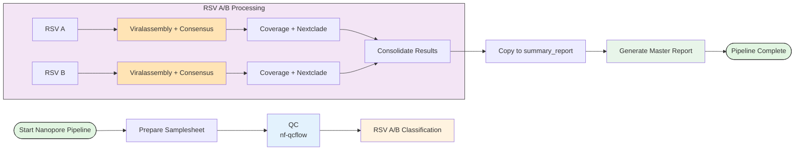

# RSV Analysis Pipeline

An automated pipeline for processing Respiratory Syncytial Virus (RSV) sequencing data from both Illumina and Nanopore platforms. This pipeline processes RSV samples through multiple stages of analysis, automatically classifying samples into RSV A or RSV B subgroups and generating comprehensive reports including consensus sequences, variant calls, coverage statistics, and phylogenetic classifications.

**Supported Platforms:**
- **Illumina**: Short-read amplicon sequencing
- **Nanopore**: Long-read amplicon sequencing

## Workflows

### Illumina Workflow


### Nanopore Workflow



## Key Differences Between Platforms

| Feature | Illumina | Nanopore |
|---------|----------|----------|
| **Analysis Pipeline** | nf-core/viralrecon | viralassembly |
| **Read Type** | Short reads (paired-end) | Long reads (single-end) |
| **Variant Calling** | iVar + BCFtools | Clair3 + BCFtools |
| **BAM Files** | `*.ivar_trim.sorted.bam` | `*.primertrimmed.rg.sorted.bam` |
| **QC Report** | `reads_illumina.qc_report.csv` | `reads_nanopore.qc_report.csv` |

## Features

- **Automated QC**: Platform-specific quality control and filtering
- **RSV Typing**: MASH-based classification into RSV A or RSV B subtypes
- **Consensus Generation**: High-quality consensus sequence generation
- **Coverage Analysis**: Detailed per-base coverage statistics
- **Phylogenetic Classification**: Nextclade-based clade assignment
- **Comprehensive Reporting**: Unified summary report combining all metrics

## Requirements

### Software & Environment
Nextflow, singularity, virus_env conda environment

### External Pipelines

| Illumina | Nanopore |
|----------|----------|
| [nf-core/viralrecon](https://github.com/nf-core/viralrecon)<br>[nf-qcflow](https://github.com/xiaoli-dong/nf-qcflow)<br>[nf-covflow](https://github.com/xiaoli-dong/nf-covflow) | [viralassembly](https://github.com/phac-nml/viralassembly)<br>[nf-qcflow](https://github.com/xiaoli-dong/nf-qcflow)<br>[nf-covflow](https://github.com/xiaoli-dong/nf-covflow) |


## Usage

### Illumina Pipeline
**Usage**
```
bash rsv_illumina_pipeline.sh <samplesheet.csv> <results_dir> [options]
```
**Required Arguments**
| Argument          | Description                               |
| ----------------- | ----------------------------------------- |
| `samplesheet.csv` | Input samplesheet in CSV format           |
| `results_dir`     | Output directory for all pipeline results |

**Options:**
| Option                     | Description                              |
| -------------------------- | ---------------------------------------- |
| `-h`, `--help`             | Show help message and exit               |
| `-v`, `--version`          | Show pipeline version and exit           |
| `--qcflow-config FILE`     | Custom configuration file for QCflow     |
| `--viralrecon-config FILE` | Custom configuration file for Viralrecon |

**Examples**


```
# Run pipeline with default configuration:
bash rsv_illumina_pipeline.sh samplesheet.csv results_2025_01_16

# Run pipeline with custom configuration files:
bash rsv_illumina_pipeline.sh samplesheet.csv results_2025_01_16 \
  --qcflow-config qcflow.config \
  --viralrecon-config viralrecon.config

#Display help without submitting jobs:
bash rsv_illumina_pipeline.sh --help
```

### Nanopore Pipeline
**Usage**
```
bash rsv_nanopore_pipeline.sh <samplesheet.csv> <results_dir> [options]
```
**Required Arguments**
| Argument          | Description                               |
| ----------------- | ----------------------------------------- |
| `samplesheet.csv` | Input samplesheet in CSV format           |
| `results_dir`     | Output directory for all pipeline results |

**Options:**
| Option                     | Description                              |
| -------------------------- | ---------------------------------------- |
| `-h`, `--help`             | Show help message and exit               |
| `-v`, `--version`          | Show pipeline version and exit           |
| `--qcflow-config FILE`     | Custom configuration file for QCflow     |
| `--viralassembly-config FILE` | Custom configuration file for Viralrecon |

**Examples**

```
# Run pipeline with default configuration:
bash rsv_nanopore_pipeline.sh samplesheet.csv results_2025_01_16

# Run pipeline with custom configuration files:
bash rsv_nanopore_pipeline.sh samplesheet.csv results_2025_01_16 \
  --qcflow-config qcflow.config \
  --viralassembly-config viralassembly.config

#Display help without submitting jobs:
bash rsv_nanopore_pipeline.sh --help
```

### Input Samplesheet Format

**Illumina (paired-end):**
```csv
sample,fastq_1,fastq_2,long_fastq
sample1,/path/to/sample1_R1.fastq.gz,/path/to/sample1_R2.fastq.gz,NA
sample2,/path/to/sample2_R1.fastq.gz,/path/to/sample2_R2.fastq.gz,NA
```

**Nanopore (single-end):**
```csv
sample,fastq_1,fastq_2,long_fastq
sample1,NA,NA,/path/to/sample1.fastq.gz
sample2,NA,NA/path/to/sample2.fastq.gz
```

### RSV Pipeline Output Structure

The RSV pipeline produces structured outputs for both Illumina and Nanopore sequencing.  
This summary highlights **common outputs** and **platform-specific differences**.

---
```
#### Top-level results (common)
results/
├── mash_screen/ # Mash RSV A/B classification per sample/barcode
├── rsvA/ # RSV-A results (aligned reads, consensus, coverage, clade)
├── rsvB/ # RSV-B results (aligned reads, consensus, coverage, clade)
├── samplesheet_.csv # Classified samplesheets
├── samplesheet_to_covflow_.csv # Covflow input samplesheets
└── summary_report/ # Final consolidated outputs
```
---

#### Final summary report (common)
```
results/summary_report/
├── mash_screen/ # Mash classification per sample/barcode
├── rsvA/ # RSV-A outputs
│ ├── all_consensus.rsvA.fasta
│ ├── all_consensus.rsvA_stats.tsv
│ ├── chromosome_coverage_depth_summary.tsv
│ ├── nextclade.* # Clade assignments
│ └── plot/ # Coverage plots
├── rsvB/ # RSV-B outputs (same structure as RSV-A)
└── rsv_master.tsv # Final merged summary table
```

---

## Platform-specific differences

| Feature / File | Illumina | Nanopore |
|----------------|----------|----------|
| QC report | `reads_illumina.qc_report.csv` | `reads_nanopore.qc_report.csv` |
| Top matches | `reads_illumina.topmatches.csv` | `reads_nanopore.topmatches.csv` |
| BAM files | Primer-trimmed & aligned (`*.ivar_trim.sorted.bam`) | Primer-trimmed + read groups (`*.primertrimmed.rg.sorted.bam`) |

---

### Key Output Files

| File | Description | notes |
|----|------------|------------|
| `rsv_master.tsv` | Consolidates QC, consensus, coverage, and clade results for all samples |  |
| `all_consensus.*.fa` | Combined consensus FASTA per rsv subgroup | for coinfection consensus sequecnes, they are recognized by the same runid-sampleid and different reference id as part of their consensus id 
| `reads_*.qc_report.csv` | Read-level QC metrics | all samples |
| `nextclade.tsv` | Clade assignment and quality metrics | all samples per rsv subgroup |
| Plot files | Amplicon & chromosome coverage PDFs/TSVs (`plot/`) |  per rsv subgroup |
| Consensus stats | `all_consensus.*_stats.tsv` | consensus coverage, completeness |
| Nextclade outputs | `nextclade.*` | `nextclade.*` (same, per sample) |
---

## Citation

If you use this pipeline, please cite:

**Illumina Pipeline:**
- [nf-core/viralrecon](https://doi.org/10.5281/zenodo.3901628)

**Nanopore Pipeline:**
- [viralassembly](https://github.com/phac-nml/viralassembly)

**Both Pipelines:**
- [Nextclade](https://clades.nextstrain.org/)
- [MASH](https://genomebiology.biomedcentral.com/articles/10.1186/s13059-016-0997-x)
- [Nextflow](https://doi.org/10.1038/nbt.3820)
- [nf-qcflow](https://github.com/xiaoli-dong/nf-qcflow)
- [nf-covflow](https://github.com/xiaoli-dong/nf-covflow)
