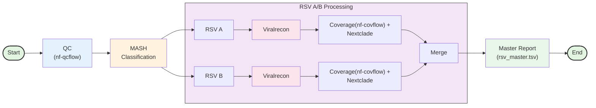
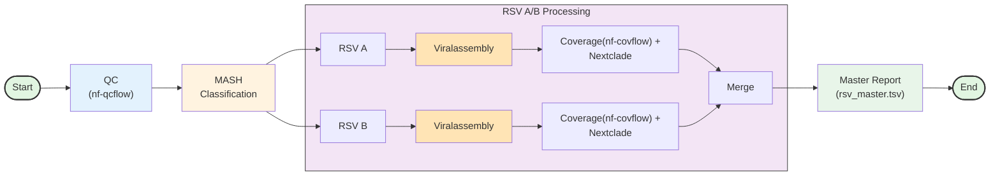

# RSV Analysis Pipeline

Automated pipeline for RSV sequencing data analysis supporting both Illumina and Nanopore platforms. Performs quality control, RSV A/B classification, consensus generation, coverage analysis, and phylogenetic classification.

[](https://www.nextflow.io/)
[](https://sylabs.io/docs/)

## Workflows

### Illumina



### Nanopore



## Platform Comparison

| Feature | Illumina | Nanopore |
|---------|----------|----------|
| **Pipeline** | [nf-core/viralrecon](https://github.com/nf-core/viralrecon) | [viralassembly](https://github.com/phac-nml/viralassembly) |
| **Read Type** | Paired-end | Single-end long reads |
| **Variant Calling** | iVar + BCFtools | Clair3 + BCFtools |
| **BAM Files** | `*.ivar_trim.sorted.bam` | `*.primertrimmed.rg.sorted.bam` |

**Shared:** [nf-qcflow](https://github.com/xiaoli-dong/nf-qcflow), [nf-covflow](https://github.com/xiaoli-dong/nf-covflow), [Nextclade](https://clades.nextstrain.org/), [MASH](https://mash.readthedocs.io/)

## Requirements

- Nextflow ≥23.04.0
- Singularity ≥3.8.0
- Conda environment: `virus_env`
- HPC with SLURM scheduler

## Usage

### Illumina
```bash
bash rsv_illumina_pipeline.sh <samplesheet.csv> <results_dir> [options]

Options:
  -h, --help                    Show help
  -v, --version                 Show version
  --qcflow-config FILE          Custom QC config
  --viralrecon-config FILE      Custom viralrecon config

# Example
bash rsv_illumina_pipeline.sh samplesheet.csv results_2025_01_16
```

### Nanopore
```bash
bash rsv_nanopore_pipeline.sh <samplesheet.csv> <results_dir> [options]

Options:
  -h, --help                    Show help
  -v, --version                 Show version
  --qcflow-config FILE          Custom QC config
  --viralassembly-config FILE   Custom assembly config

# Example
bash rsv_nanopore_pipeline.sh samplesheet.csv results_2025_01_16
```

## Input Samplesheet

**Illumina:**
```csv
sample,fastq_1,fastq_2,long_fastq
sample1,/path/to/R1.fastq.gz,/path/to/R2.fastq.gz,NA
```

**Nanopore:**
```csv
sample,fastq_1,fastq_2,long_fastq
sample1,NA,NA,/path/to/reads.fastq.gz
```

## Output Structure

```
results/
├── nf-qcflow/report/              # QC metrics
├── mash_screen/                   # RSV A/B classification
├── rsvA/                          # RSV A results
│   ├── viralrecon/viralassembly/  # Platform-specific
│   ├── nf-covflow/                # Coverage analysis
│   └── nextclade/                 # Phylogenetic classification
├── rsvB/                          # RSV B results (same structure)
└── summary_report/                # ⭐ Final outputs
    ├── rsv_master.tsv             # Master summary table
    ├── rsvA/
    │   ├── all_consensus.rsvA.fasta
    │   ├── all_consensus.rsvA_stats.tsv
    │   ├── chromosome_coverage_depth_summary.tsv
    │   ├── nextclade.tsv
    │   ├── *.bam / *.bam.bai
    │   └── plot/                   # Coverage plots (PDF/TSV)
    └── rsvB/                       # Same as rsvA/
```

## Key Output Files

| File | Description |
|------|-------------|
| `rsv_master.tsv` | Master summary combining QC, consensus, coverage, and phylogenetic data |
| `all_consensus.*.fasta` | Combined consensus sequences per RSV subtype |
| `reads_*.qc_report.csv` | Per-sample QC metrics |
| `nextclade.tsv` | Clade assignments and quality metrics |
| `*_stats.tsv` | Consensus coverage and completeness statistics |
| `plot/*.pdf` | Amplicon and chromosome coverage visualizations |

**Note:** Co-infections produce consensus sequences with same sequence id prefix but different reference IDs (e.g., `run1-sample1|ref1`, `run1-sample1|ref2`)

## Troubleshooting

**Conda environment not found:**
```bash
conda env create -f environment.yml
conda activate virus_env
```

**No consensus generated:**
- Check QC report: `nf-qcflow/report/*.qc_report.csv`
- Check MASH classification: `mash_screen/*.tsv`
- Review coverage: `nf-covflow/report/`

**Nextflow issues:**
```bash
rm -rf work/
nextflow clean -f
```

## Citation

**Illumina:** [nf-core/viralrecon](https://doi.org/10.5281/zenodo.3901628)  
**Nanopore:** [viralassembly](https://github.com/phac-nml/viralassembly)  
**Shared:** [Nextflow](https://doi.org/10.1038/nbt.3820), [MASH](https://doi.org/10.1186/s13059-016-0997-x), [Nextclade](https://doi.org/10.21105/joss.03773), [nf-qcflow](https://github.com/xiaoli-dong/nf-qcflow), [nf-covflow](https://github.com/xiaoli-dong/nf-covflow)

## Credits
- **rsv-analyzer** was written by **Xiaoli Dong**
- Extensive support was provided by the **ProvLab Research Team** in Calgary for generating sequencing data, conducting the pipeline testing, providing feedback for improvements:
  >- **Johanna M Thayer**
  >- **Petya Kolva**
  >- **Kara Gill**
  >- **Anita Wong**
  >- **Kanti Pabbaraju**
  >- **Tarah Lynch**
