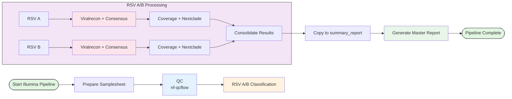

# RSV Analysis Pipeline

An automated pipeline for processing Respiratory Syncytial Virus (RSV) sequencing data from both Illumina and Nanopore platforms, including quality control, viral classification, consensus generation, and phylogenetic analysis.

## Overview

This pipeline processes RSV samples through multiple stages of analysis, automatically classifying samples into RSV A or RSV B subtypes and generating comprehensive reports including consensus sequences, variant calls, coverage statistics, and phylogenetic classifications.

**Supported Platforms:**
- **Illumina**: Short-read amplicon sequencing
- **Nanopore**: Long-read amplicon sequencing

## Workflows

### Illumina Workflow


### Nanopore Workflow


## Key Differences Between Platforms

| Feature | Illumina | Nanopore |
|---------|----------|----------|
| **Analysis Pipeline** | nf-core/viralrecon | viralassembly |
| **Read Type** | Short reads (paired-end) | Long reads (single-end) |
| **Variant Calling** | iVar + BCFtools | Medaka/Clair3 |
| **BAM Files** | `*.ivar_trim.sorted.bam` | `*.primertrimmed.rg.sorted.bam` |
| **QC Report** | `reads_illumina.qc_report.csv` | `reads_nanopore.qc_report.csv` |

## Features

- **Automated QC**: Platform-specific quality control and filtering
- **RSV Typing**: MASH-based classification into RSV A or RSV B subtypes
- **Consensus Generation**: High-quality consensus sequence generation
- **Coverage Analysis**: Detailed per-base coverage statistics
- **Phylogenetic Classification**: Nextclade-based clade assignment
- **Comprehensive Reporting**: Unified summary report combining all metrics

## Requirements

### Software Dependencies

- Nextflow
- Conda/Mamba
- Singularity
- Python 3.x

### Conda Environment

The pipeline requires a conda environment named `virus_env` with necessary Python dependencies.

### External Pipelines

**Illumina:**
- [nf-core/viralrecon](https://github.com/nf-core/viralrecon)
- [nf-qcflow](https://github.com/xiaoli-dong/nf-qcflow)
- [nf-covflow](https://github.com/xiaoli-dong/nf-covflow)

**Nanopore:**
- [viralassembly](https://github.com/phac-nml/viralassembly)
- [nf-qcflow](https://github.com/xiaoli-dong/nf-qcflow)
- [nf-covflow](https://github.com/xiaoli-dong/nf-covflow)

## Installation

```bash
# Clone the repository
git clone <repository-url>
cd rsv-pipeline

# Ensure conda environment is created
conda env create -f environment.yml
```

## Usage

### Illumina Pipeline

```bash
# Basic usage
./bin/rsv_illumina.sh <samplesheet.csv> <results_dir>

# With custom config
./bin/rsv_illumina.sh --viralrecon-config custom.config samplesheet.csv results/
```

**Options:**
```
  -h, --help                    Show help message
  -v, --version                 Show version
  --viralrecon-config FILE      Custom viralrecon configuration file
```

### Nanopore Pipeline

```bash
# Basic usage
./bin/rsv_nanopore.sh <samplesheet.csv> <results_dir>

# With custom config
./bin/rsv_nanopore.sh --viralassembly-config custom.config samplesheet.csv results/
```

**Options:**
```
  -h, --help                      Show help message
  -v, --version                   Show version
  --viralassembly-config FILE     Custom viralassembly configuration file
```

### Input Samplesheet Format

**Illumina (paired-end):**
```csv
sample,fastq_1,fastq_2
sample1,/path/to/sample1_R1.fastq.gz,/path/to/sample1_R2.fastq.gz
sample2,/path/to/sample2_R1.fastq.gz,/path/to/sample2_R2.fastq.gz
```

**Nanopore (single-end):**
```csv
sample,fastq
sample1,/path/to/sample1.fastq.gz
sample2,/path/to/sample2.fastq.gz
```

## Output Structure

### Common Structure (Both Platforms)

```
results/
├── nf-qcflow/                          # QC results (platform-specific)
│   └── report/
│       ├── reads_*.qc_report.csv       # * = illumina or nanopore
│       └── reads_*.topmatches.csv
├── mash_screen/                        # RSV typing results
├── rsvA/                               # RSV A analysis
│   ├── viralrecon/ OR viralassembly/   # Platform-specific
│   ├── nf-covflow/                     # Coverage analysis
│   └── nextclade/                      # Phylogenetic classification
├── rsvB/                               # RSV B analysis
│   ├── viralrecon/ OR viralassembly/
│   ├── nf-covflow/
│   └── nextclade/
└── summary_report/                     # Final consolidated results
    ├── rsv_master.tsv                  # Master summary report
    ├── rsvA/
    │   ├── *.consensus.fa OR *.fasta
    │   ├── *.bam
    │   └── nextclade.tsv
    └── rsvB/
        ├── *.consensus.fa OR *.fasta
        ├── *.bam
        └── nextclade.tsv
```

### Illumina-Specific Outputs

```
rsvA/viralrecon/
├── variants/
│   ├── ivar/
│   │   └── consensus/
│   │       └── bcftools/
│   │           ├── *.consensus.fa
│   │           ├── *.filtered.vcf.gz
│   │           └── all_consensus_stats.tsv
│   └── bowtie2/
│       └── *.ivar_trim.sorted.bam
```

### Nanopore-Specific Outputs

```
rsvA/viralassembly/
├── consensus/
│   ├── *.fasta
│   └── all_consensus_stats.tsv
└── bam/
    └── *.primertrimmed.rg.sorted.bam
```

## Key Output Files

- **rsv_master.tsv**: Master summary report combining QC, consensus, coverage, and phylogenetic data
- **consensus files**: `.fa` (Illumina) or `.fasta` (Nanopore)
- **filtered.vcf.gz**: Filtered variant calls (Illumina only)
- **nextclade.tsv**: Phylogenetic clade assignments and quality metrics
- **chromosome_coverage_depth_summary.tsv**: Per-sample coverage statistics

## Pipeline Steps

Both pipelines follow similar workflow:

1. **Samplesheet Preparation**: Validates and prepares input samplesheet
2. **Quality Control**: Platform-specific QC (nf-qcflow)
3. **RSV Classification**: MASH-based typing into RSV A or RSV B
4. **Parallel Processing**: 
   - **Illumina**: Viralrecon (variant calling + consensus)
   - **Nanopore**: Viralassembly (consensus assembly)
   - Consensus statistics calculation
   - Coverage analysis (nf-covflow)
   - Phylogenetic classification (Nextclade)
5. **Result Consolidation**: Collect outputs into summary_report/
6. **Final Report**: Generate unified rsv_master.tsv

## Reference Data

The pipeline uses RSV primer schemes and reference genomes:

```
resource/
├── primerschemes/
│   ├── rsvA/v3/
│   │   ├── reference.fasta
│   │   └── scheme.bed
│   └── rsvB/v3/
│       ├── reference.fasta
│       └── scheme.bed
└── db/
    └── mash_screen/
        └── sequences.msh
```

## Configuration

### Default Configurations

**Illumina:**
- `conf/viralrecon.config`: Viralrecon parameters
- `conf/slurm.config`: SLURM job submission settings

**Nanopore:**
- `conf/viralassembly.config`: Viralassembly parameters
- `conf/qcflow.config`: QC pipeline parameters
- `conf/slurm.config`: SLURM job submission settings

### Custom Configuration

**Illumina:**
```bash
./bin/rsv_illumina.sh --viralrecon-config /path/to/custom.config samplesheet.csv results/
```

**Nanopore:**
```bash
./bin/rsv_nanopore.sh --viralassembly-config /path/to/custom.config samplesheet.csv results/
```

## Troubleshooting

### Common Issues

1. **Conda environment not found**: Ensure `virus_env` is created and activated
2. **Missing reference files**: Check that all resource files exist in expected locations
3. **Nextflow resume**: Both pipelines use `-resume` flag for recovery
4. **No consensus files found**: Check if samples passed QC and classification steps

### Platform-Specific Issues

**Illumina:**
- Ensure paired-end FASTQ files are correctly specified
- Check iVar trimming parameters if primer removal fails

**Nanopore:**
- Verify basecalling quality (Q-score filtering)
- Check read length distribution matches amplicon scheme

### Logs

Pipeline logs include timestamps and version information:

```
[2024-12-22 10:30:15] [rsv_illumina.sh-1.0] Running: nextflow run ...
[2024-12-22 10:45:30] [rsv_nanopore.sh-1.0] Running: python screen_rsv_mash.py ...
```

## Best Practices

1. **Quality Control**: Review QC reports before proceeding with analysis
2. **Mixed Samples**: The pipeline automatically handles samples with mixed RSV A/B classifications
3. **Resource Allocation**: Adjust SLURM configuration based on sample count and cluster capacity
4. **Data Management**: Keep raw data separate from results directory
5. **Version Control**: Use `--version` flag to track pipeline versions

## Contributing

Contributions are welcome! Please submit issues or pull requests.

## License

[Specify your license here]

## Contact

[Specify contact information]

## Citation

If you use this pipeline, please cite:

**Illumina Pipeline:**
- [nf-core/viralrecon](https://doi.org/10.5281/zenodo.3901628)
- [iVar](https://doi.org/10.1186/s13059-018-1618-7)

**Nanopore Pipeline:**
- [Medaka](https://github.com/nanoporetech/medaka)

**Both Pipelines:**
- [Nextclade](https://clades.nextstrain.org/)
- [MASH](https://genomebiology.biomedcentral.com/articles/10.1186/s13059-016-0997-x)
- [Nextflow](https://doi.org/10.1038/nbt.3820)
